# JNIC 2025: CTF WriteUp
###### Matxin Jiménez

## Forense

### Primer Flag

En este reto nos dan el trafico capturado de una red que a podido estar infectada. Debemos analizar el trafico y ver que descubrimos.


Tras pasar un rato largo indagando a traves de todas las peticiones, (filtrando por http para ver trafico no cifrado, dns para ver a que dominios resolvia, etc.) no encontre nada. Entonces aprendi que Wireshark ofrece una opción llamada "Export Objects", que permite extraer archivos u objetos transmitidos en una captura de red.

Vi que tres archivos habian sido enviados a través de la red usando el protocolo SMB.

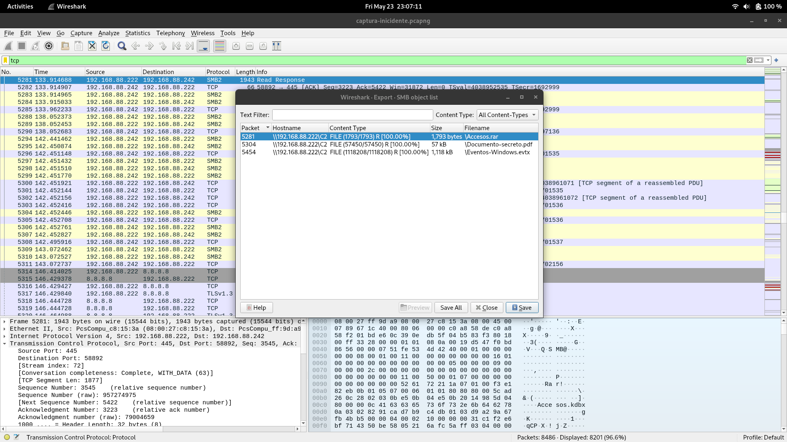

Los guarde y procedi a analizarlos.

```
matxin@matxin  ~/Workspace/uni/4/1/sgssi/forense/prueba  ls
%5cAccesos.rar  %5cDocumento-secreto.pdf  %5cEventos-Windows.evtx
```

Al abrir el .pdf me encontre con lo siguiente:

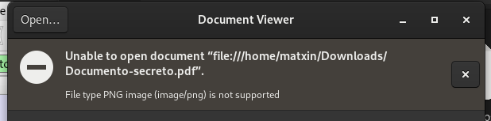

El .pdf parece ser en realidad, una imagen .png. Al cambiar la extensión del archivo descubri que es era codigo QR.

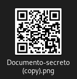

Al escanearlo, me llevó a una pagina con caracteres aparentemente aleatorios.

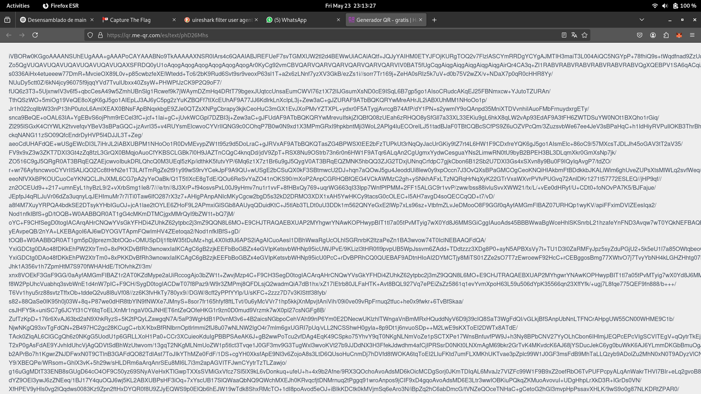

> "El azar no es más que la medida de nuestra ignorancia."  
> — *Henri Poincaré*

Le pasé el comienzo del string a ChatGPT y me dijo que:

> la parte inicial "iVBOR" es común en muchos archivos PNG codificados en Base64.

Copie el texto a un archivo y genere la imagen y ¿que obtuve? Otro codigo QR.

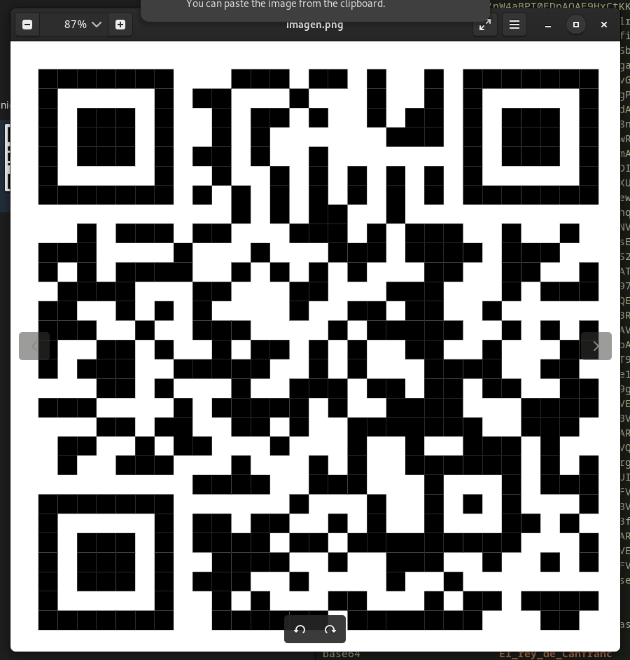

Esta vez me llevo a una página con contenido un tanto esoterico:

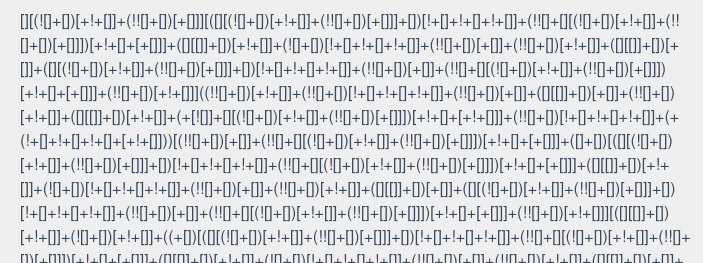

Naturalmente, le pregunte a ChatGPT a ver de que se trataba.

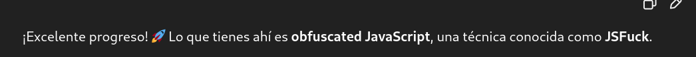

Al saber que se trataba de JavaScript, lo ejecute directamente desde la consola del navegador.

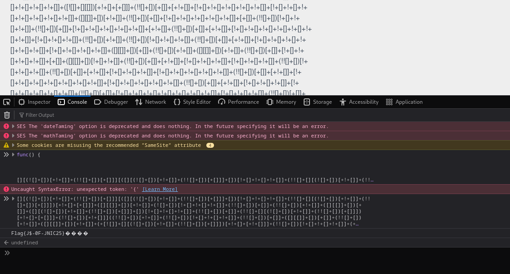

Así obtuve el primer flag.

### Segundo Flag

Decidí seguir analizando el archivo Eventos-Windows.evtx, que es un archivo de registro de eventos del sistema utilizado por Windows para almacenar eventos del Visor de eventos (Event Viewer).

Lo metí a un USB y booteé Windows :(

No fue poco el tiempo que pase mirando los logs. Incluso vi mensajes que los creadores de la prueba nos habian dejado a los participantes.

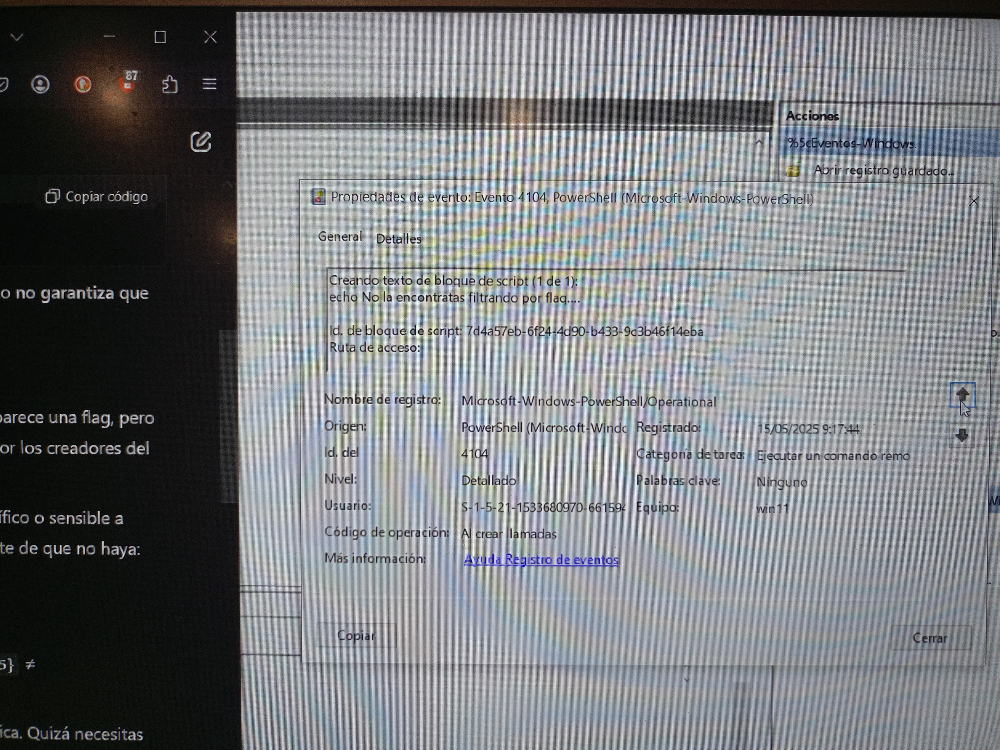

Encontre algo que capto mi atención.

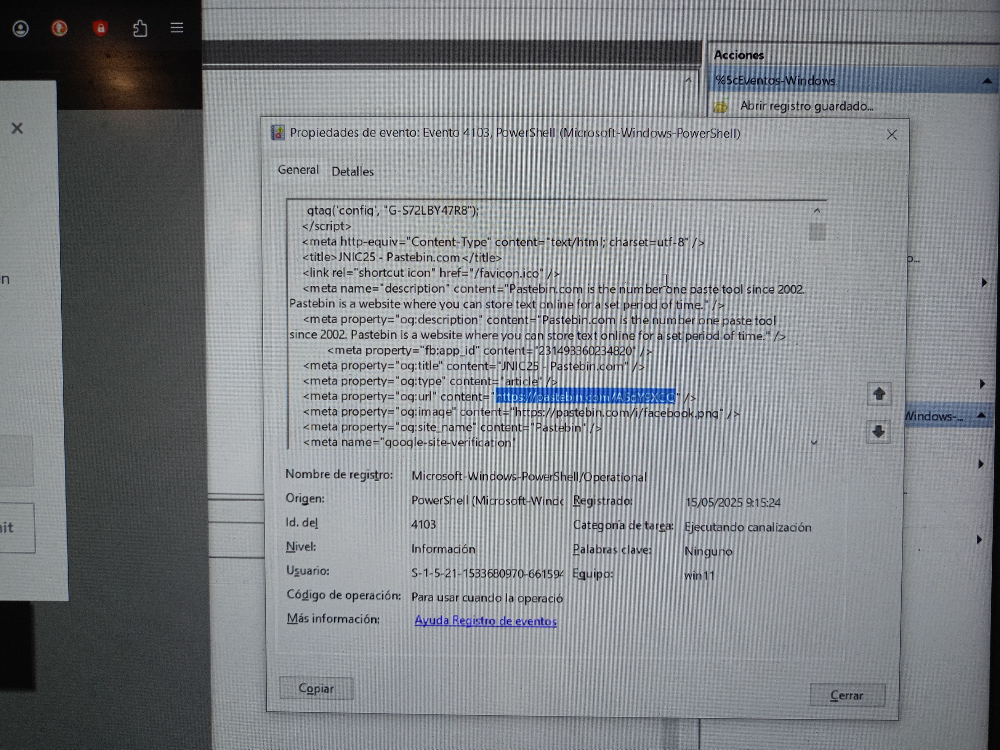

Y al dirigirme a esa dirección, encontre lo siguiente

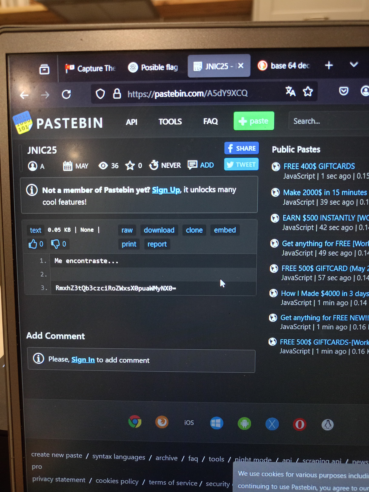

Lo decodifique y obtuve el segundo flag.

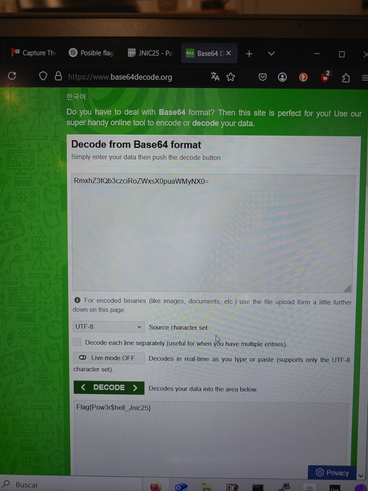

### Tercer Flag

Volvi a bootear Debian y descomprimí el .tar, que era el unico archivo que me quedaba por analizar.

```
matxin@matxin  ~/Workspace/uni/4/1/sgssi/forense/prueba/%5cAccesos  ls
Accesos.kdbx  Accesos.key
```

Como no sabia lo que era un .kdbx, lo busque en internet:

> Un archivo .kdbx es una base de datos de contraseñas cifrada utilizada por el gestor de contraseñas KeePass

Accesos.kdbx estaba cifrado con Accesos.key y una contraseña. Use diferentes herramientas para encontrar la contraseña con el famoso diccionario rockyou y no obtuve ningun positivo.

Volvi a bootear Windows y a analizar el .evtx para ver si me habia saltado alguna credencial que pudiera usar. Trás un un tiempo considerable llegue a la conclusión que no habia nada util.

Fue entonces cuando se me ocurrio buscar las credenciales en el .pcapng. Las encontre y procedi a abrir el .kdbx usando KeePassXC.

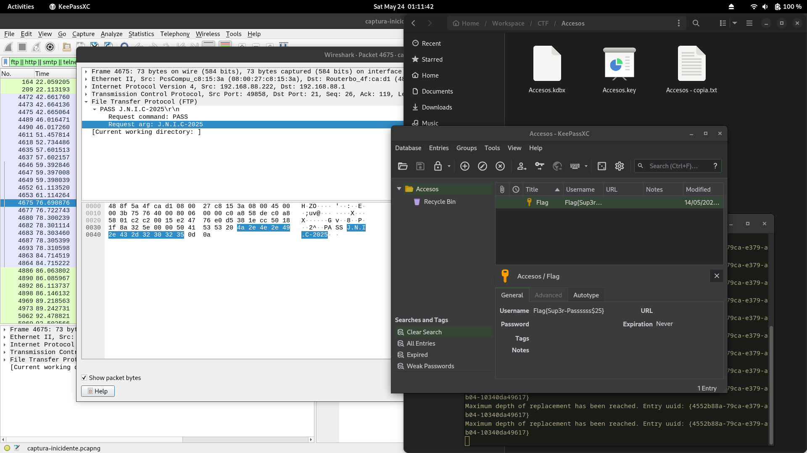

Asi logre el tercer y ultimo flag de esta prueba.