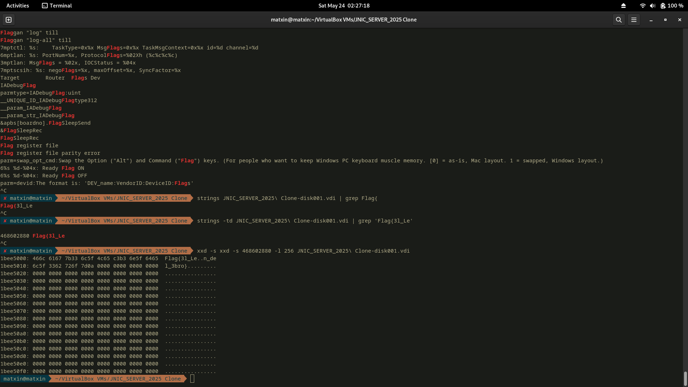
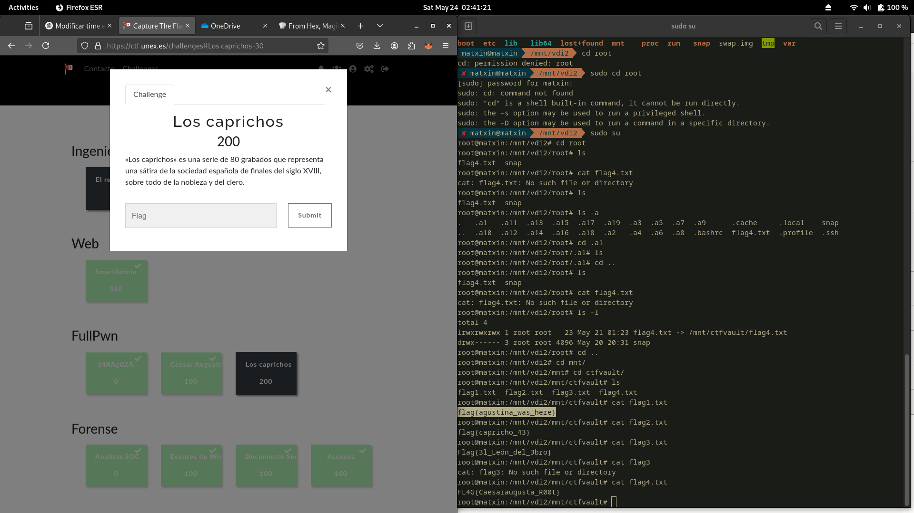
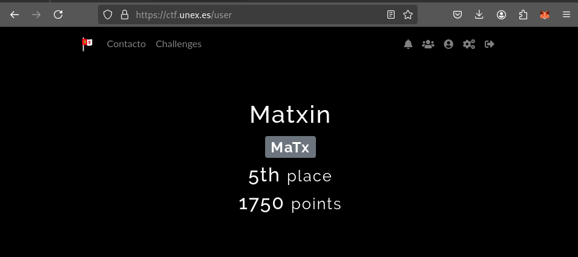

# JNIC 2025: CTF WriteUp
###### Matxin Jiménez

## Full Pwn

En este reto me dieron un .ova para ejecutar el servidor en una maquina virtual. Lo lance y realize un escaneo de puertos.

```
matxin@matxin  ~  nmap 192.168.1.126
Starting Nmap 7.93 ( https://nmap.org ) at 2025-05-28 17:17 CEST
Nmap scan report for 192.168.1.126
Host is up (0.00010s latency).
Not shown: 997 closed tcp ports (conn-refused)
PORT     STATE SERVICE
22/tcp   open  ssh
8009/tcp open  ajp13
8080/tcp open  http-proxy
```

Sin embargo, al igual que en otro reto anterior, pude analizar el .vdi (disco virtual) que la maquina estaba usando.

Busque el string "Flag{" y obtuve lo siguiente:

 

Pensaba que eso era todo, sin embargo, cuando meti el flag obtenido en la página del CTF me dijo que era incorrecta.

Monté en .vdi en mi maquina, entre al directorio root y vi el archivo flag4.txt, pero no me dejaba leerlo. Vi que era un enlace a /mnt/ctfvault/flag4.txt. Fui a ese directorio y me encontre con una mina de oro. ¡Todos los flags de la prueba estaban alli! 

 

Al hacer meter todos los flags en la web, me posicione como 5º equipo de la competición. Desgraciadamente, el reto de ingenieria inversa se me resistio y para cuando finalizo el CTF, me habian adelantado 5 equipos, terminando en 10º posición.

