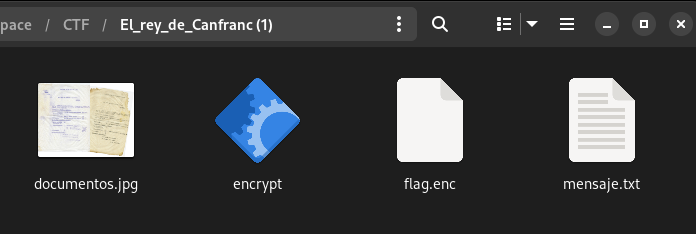
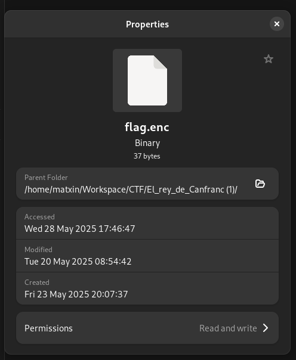

# JNIC 2025: CTF WriteUp
###### Matxin Jiménez

## Ingenieria Inversa

Para este reto me dieron cuatro archivos.



El mensaje decia lo siguiente:

```
Origen: Estación Internacional de Canfranc
Fecha: [CENSURADO]

Clasificación: Ultra Secreta
Remitente: Jefe de la aduana francesa Albert le Lay
Destino: Ministerio del Tiempo

--------------------------------------------------------------------------------

A la atención del Sr. Salvador Martí,

Hoy, durante mi inspección rutinaria en los almacenes de la estación, detecté
una anomalía temporal. Escuché voces en inglés en un sector que debía estar
vacío. Al investigar, encontré el cuerpo sin vida de un hombre que no pertenece
a esta época. Su indumentaria, tecnología y documentación lo delatan: es un
viajero del tiempo procedente del siglo XXI.

Entre sus pertenencias hallé un dispositivo de comunicaciones cifrado,
claramente no fabricado en nuestra era. También portaba una copia de un
documento oficial fechado hoy, que detalla el tránsito de mercancías por esta
estación. El documento menciona el paso de 1096 kilogramos de lingotes de oro
procedentes del Tercer Reich. Todo indica que este individuo viajó a esta fecha
con el objetivo de interceptar y robar dicho cargamento, alterando así el curso
de la historia.

Sospecho que no actuaba solo. El dispositivo contiene información cifrada que
podría revelar más detalles sobre su misión y sus cómplices. Solicito el envío
inmediato de una patrulla del Ministerio, equipada y preparada para una posible
confrontación. Es probable que haya más intrusos en la zona, y no se descarta
que estén armados. La situación requiere intervención urgente para evitar una
alteración crítica en la línea temporal.

El artefacto y los documentos han sido asegurados y entregados a un funcionario
del Ministerio del Tiempo para su custodia y análisis. Ruego máxima discreción
y celeridad. El tiempo, como siempre, está en juego.

Con respeto y lealtad,
Albert le Lay
```

El archivo flag.enc contenia caracteres ilegibles. Y en la foto documentos.jpg estan los documentos de los que se habla en el mensaje.

Abri el binario encrypt usando gdb y desensamble el main.

```
(gdb) disassemble main
Dump of assembler code for function main:
   0x00000000000011e9 <+0>:	push   %rbp
   0x00000000000011ea <+1>:	mov    %rsp,%rbp
   0x00000000000011ed <+4>:	sub    $0x40,%rsp
   0x00000000000011f1 <+8>:	movq   $0x0,-0x20(%rbp)
   0x00000000000011f9 <+16>:	movq   $0x0,-0x18(%rbp)
   0x0000000000001201 <+24>:	movl   $0x0,-0x34(%rbp)
   0x0000000000001208 <+31>:	movq   $0x0,-0x10(%rbp)
   0x0000000000001210 <+39>:	movl   $0x0,-0x30(%rbp)
   0x0000000000001217 <+46>:	movl   $0x0,-0x2c(%rbp)
   0x000000000000121e <+53>:	movq   $0x0,-0x8(%rbp)
   0x0000000000001226 <+61>:	lea    0xdd7(%rip),%rdx        # 0x2004
   0x000000000000122d <+68>:	lea    0xdd3(%rip),%rax        # 0x2007
   0x0000000000001234 <+75>:	mov    %rdx,%rsi
   0x0000000000001237 <+78>:	mov    %rax,%rdi
   0x000000000000123a <+81>:	call   0x10c0 <fopen@plt>
   0x000000000000123f <+86>:	mov    %rax,-0x20(%rbp)
   0x0000000000001243 <+90>:	cmpq   $0x0,-0x20(%rbp)
   0x0000000000001248 <+95>:	jne    0x1268 <main+127>
   0x000000000000124a <+97>:	lea    0xdbf(%rip),%rax        # 0x2010
   0x0000000000001251 <+104>:	mov    %rax,%rdi
   0x0000000000001254 <+107>:	mov    $0x0,%eax
   0x0000000000001259 <+112>:	call   0x1060 <printf@plt>
--Type <RET> for more, q to quit, c to continue without paging--
   0x000000000000125e <+117>:	mov    $0x1,%eax
   0x0000000000001263 <+122>:	jmp    0x1454 <main+619>
   0x0000000000001268 <+127>:	mov    -0x20(%rbp),%rax
   0x000000000000126c <+131>:	mov    $0x2,%edx
   0x0000000000001271 <+136>:	mov    $0x0,%esi
   0x0000000000001276 <+141>:	mov    %rax,%rdi
   0x0000000000001279 <+144>:	call   0x10b0 <fseek@plt>
   0x000000000000127e <+149>:	mov    -0x20(%rbp),%rax
   0x0000000000001282 <+153>:	mov    %rax,%rdi
   0x0000000000001285 <+156>:	call   0x1080 <ftell@plt>
   0x000000000000128a <+161>:	mov    %eax,-0x34(%rbp)
   0x000000000000128d <+164>:	mov    -0x20(%rbp),%rax
   0x0000000000001291 <+168>:	mov    $0x0,%edx
   0x0000000000001296 <+173>:	mov    $0x0,%esi
   0x000000000000129b <+178>:	mov    %rax,%rdi
   0x000000000000129e <+181>:	call   0x10b0 <fseek@plt>
   0x00000000000012a3 <+186>:	mov    -0x34(%rbp),%eax
   0x00000000000012a6 <+189>:	cltq
   0x00000000000012a8 <+191>:	mov    %rax,%rdi
   0x00000000000012ab <+194>:	call   0x10a0 <malloc@plt>
   0x00000000000012b0 <+199>:	mov    %rax,-0x8(%rbp)
   0x00000000000012b4 <+203>:	mov    -0x34(%rbp),%eax
   0x00000000000012b7 <+206>:	movslq %eax,%rsi
--Type <RET> for more, q to quit, c to continue without paging--
   0x00000000000012ba <+209>:	mov    -0x20(%rbp),%rdx
   0x00000000000012be <+213>:	mov    -0x8(%rbp),%rax
   0x00000000000012c2 <+217>:	mov    %rdx,%rcx
   0x00000000000012c5 <+220>:	mov    $0x1,%edx
   0x00000000000012ca <+225>:	mov    %rax,%rdi
   0x00000000000012cd <+228>:	call   0x1040 <fread@plt>
   0x00000000000012d2 <+233>:	mov    -0x20(%rbp),%rax
   0x00000000000012d6 <+237>:	mov    %rax,%rdi
   0x00000000000012d9 <+240>:	call   0x1050 <fclose@plt>
   0x00000000000012de <+245>:	mov    $0x0,%edi
   0x00000000000012e3 <+250>:	call   0x1090 <time@plt>
   0x00000000000012e8 <+255>:	mov    %eax,-0x28(%rbp)
   0x00000000000012eb <+258>:	mov    -0x28(%rbp),%eax
   0x00000000000012ee <+261>:	mov    %eax,%edi
   0x00000000000012f0 <+263>:	call   0x1070 <srand@plt>
   0x00000000000012f5 <+268>:	movl   $0x0,-0x38(%rbp)
   0x00000000000012fc <+275>:	jmp    0x13d1 <main+488>
   0x0000000000001301 <+280>:	call   0x10e0 <rand@plt>
   0x0000000000001306 <+285>:	mov    %eax,-0x24(%rbp)
   0x0000000000001309 <+288>:	mov    -0x38(%rbp),%eax
   0x000000000000130c <+291>:	movslq %eax,%rdx
   0x000000000000130f <+294>:	mov    -0x8(%rbp),%rax
   0x0000000000001313 <+298>:	add    %rdx,%rax
--Type <RET> for more, q to quit, c to continue without paging--
   0x0000000000001316 <+301>:	movzbl (%rax),%ecx
   0x0000000000001319 <+304>:	mov    -0x24(%rbp),%eax
   0x000000000000131c <+307>:	mov    %eax,%esi
   0x000000000000131e <+309>:	mov    -0x38(%rbp),%eax
   0x0000000000001321 <+312>:	movslq %eax,%rdx
   0x0000000000001324 <+315>:	mov    -0x8(%rbp),%rax
   0x0000000000001328 <+319>:	add    %rdx,%rax
   0x000000000000132b <+322>:	xor    %esi,%ecx
   0x000000000000132d <+324>:	mov    %ecx,%edx
   0x000000000000132f <+326>:	mov    %dl,(%rax)
   0x0000000000001331 <+328>:	call   0x10e0 <rand@plt>
   0x0000000000001336 <+333>:	and    $0x7,%eax
   0x0000000000001339 <+336>:	mov    %eax,-0x30(%rbp)
   0x000000000000133c <+339>:	mov    -0x38(%rbp),%eax
   0x000000000000133f <+342>:	movslq %eax,%rdx
   0x0000000000001342 <+345>:	mov    -0x8(%rbp),%rax
   0x0000000000001346 <+349>:	add    %rdx,%rax
   0x0000000000001349 <+352>:	movzbl (%rax),%eax
   0x000000000000134c <+355>:	movsbl %al,%edx
   0x000000000000134f <+358>:	mov    -0x30(%rbp),%eax
   0x0000000000001352 <+361>:	movsbl %al,%eax
   0x0000000000001355 <+364>:	mov    %eax,%ecx
   0x0000000000001357 <+366>:	shl    %cl,%edx
--Type <RET> for more, q to quit, c to continue without paging--
   0x0000000000001359 <+368>:	mov    %edx,%eax
   0x000000000000135b <+370>:	mov    %eax,%edi
   0x000000000000135d <+372>:	mov    -0x38(%rbp),%eax
   0x0000000000001360 <+375>:	movslq %eax,%rdx
   0x0000000000001363 <+378>:	mov    -0x8(%rbp),%rax
   0x0000000000001367 <+382>:	add    %rdx,%rax
   0x000000000000136a <+385>:	movzbl (%rax),%eax
   0x000000000000136d <+388>:	movzbl %al,%esi
   0x0000000000001370 <+391>:	mov    -0x30(%rbp),%eax
   0x0000000000001373 <+394>:	movsbl %al,%eax
   0x0000000000001376 <+397>:	mov    $0x8,%edx
   0x000000000000137b <+402>:	sub    %eax,%edx
   0x000000000000137d <+404>:	mov    %esi,%eax
   0x000000000000137f <+406>:	mov    %edx,%ecx
   0x0000000000001381 <+408>:	sar    %cl,%eax
   0x0000000000001383 <+410>:	mov    %eax,%ecx
   0x0000000000001385 <+412>:	mov    -0x38(%rbp),%eax
   0x0000000000001388 <+415>:	movslq %eax,%rdx
   0x000000000000138b <+418>:	mov    -0x8(%rbp),%rax
   0x000000000000138f <+422>:	add    %rdx,%rax
   0x0000000000001392 <+425>:	or     %ecx,%edi
   0x0000000000001394 <+427>:	mov    %edi,%edx
   0x0000000000001396 <+429>:	mov    %dl,(%rax)
--Type <RET> for more, q to quit, c to continue without paging--
   0x0000000000001398 <+431>:	call   0x10e0 <rand@plt>
   0x000000000000139d <+436>:	call   0x10e0 <rand@plt>
   0x00000000000013a2 <+441>:	mov    %eax,-0x2c(%rbp)
   0x00000000000013a5 <+444>:	mov    -0x2c(%rbp),%eax
   0x00000000000013a8 <+447>:	mov    %eax,%esi
   0x00000000000013aa <+449>:	mov    -0x38(%rbp),%eax
   0x00000000000013ad <+452>:	movslq %eax,%rdx
   0x00000000000013b0 <+455>:	mov    -0x8(%rbp),%rax
   0x00000000000013b4 <+459>:	add    %rdx,%rax
   0x00000000000013b7 <+462>:	movzbl (%rax),%ecx
   0x00000000000013ba <+465>:	mov    -0x38(%rbp),%eax
   0x00000000000013bd <+468>:	movslq %eax,%rdx
   0x00000000000013c0 <+471>:	mov    -0x8(%rbp),%rax
   0x00000000000013c4 <+475>:	add    %rdx,%rax
   0x00000000000013c7 <+478>:	xor    %ecx,%esi
   0x00000000000013c9 <+480>:	mov    %esi,%edx
   0x00000000000013cb <+482>:	mov    %dl,(%rax)
   0x00000000000013cd <+484>:	addl   $0x1,-0x38(%rbp)
   0x00000000000013d1 <+488>:	mov    -0x38(%rbp),%eax
   0x00000000000013d4 <+491>:	cmp    -0x34(%rbp),%eax
   0x00000000000013d7 <+494>:	jl     0x1301 <main+280>
   0x00000000000013dd <+500>:	lea    0xc4a(%rip),%rdx        # 0x202e
   0x00000000000013e4 <+507>:	lea    0xc46(%rip),%rax        # 0x2031
--Type <RET> for more, q to quit, c to continue without paging--
   0x00000000000013eb <+514>:	mov    %rdx,%rsi
   0x00000000000013ee <+517>:	mov    %rax,%rdi
   0x00000000000013f1 <+520>:	call   0x10c0 <fopen@plt>
   0x00000000000013f6 <+525>:	mov    %rax,-0x18(%rbp)
   0x00000000000013fa <+529>:	cmpq   $0x0,-0x18(%rbp)
   0x00000000000013ff <+534>:	jne    0x141c <main+563>
   0x0000000000001401 <+536>:	lea    0xc32(%rip),%rax        # 0x203a
   0x0000000000001408 <+543>:	mov    %rax,%rdi
   0x000000000000140b <+546>:	mov    $0x0,%eax
   0x0000000000001410 <+551>:	call   0x1060 <printf@plt>
   0x0000000000001415 <+556>:	mov    $0x1,%eax
   0x000000000000141a <+561>:	jmp    0x1454 <main+619>
   0x000000000000141c <+563>:	mov    -0x34(%rbp),%eax
   0x000000000000141f <+566>:	movslq %eax,%rdx
   0x0000000000001422 <+569>:	mov    -0x18(%rbp),%rcx
   0x0000000000001426 <+573>:	mov    -0x8(%rbp),%rax
   0x000000000000142a <+577>:	mov    $0x1,%esi
   0x000000000000142f <+582>:	mov    %rax,%rdi
   0x0000000000001432 <+585>:	call   0x10d0 <fwrite@plt>
   0x0000000000001437 <+590>:	mov    -0x18(%rbp),%rax
   0x000000000000143b <+594>:	mov    %rax,%rdi
   0x000000000000143e <+597>:	call   0x1050 <fclose@plt>
   0x0000000000001443 <+602>:	mov    -0x8(%rbp),%rax
--Type <RET> for more, q to quit, c to continue without paging--
   0x0000000000001447 <+606>:	mov    %rax,%rdi
   0x000000000000144a <+609>:	call   0x1030 <free@plt>
   0x000000000000144f <+614>:	mov    $0x0,%eax
   0x0000000000001454 <+619>:	leave
   0x0000000000001455 <+620>:	ret
End of assembler dump.
```

Use una IA que lo tradujo a C.

```

#include <stdio.h>
#include <stdlib.h>
#include <time.h>

int main() {
    FILE *input_file = NULL;           // -0x20(%rbp)
    FILE *output_file = NULL;          // -0x18(%rbp) 
    int file_size = 0;                 // -0x34(%rbp)
    void *unused_ptr = NULL;           // -0x10(%rbp)
    int shift_amount = 0;              // -0x30(%rbp)
    int second_random = 0;             // -0x2c(%rbp)
    char *buffer = NULL;               // -0x8(%rbp)
    int time_value = 0;                // -0x28(%rbp)
    int first_random = 0;              // -0x24(%rbp)
    int loop_counter = 0;              // -0x38(%rbp)
    
    // Open input file for reading
    input_file = fopen("input.txt", "r");
    
    // Check if file opened successfully
    if (input_file == NULL) {
        printf("Error: Cannot open input file\n");
        return 1;
    }
    
    // Get file size by seeking to end
    fseek(input_file, 0, SEEK_END);
    file_size = ftell(input_file);
    
    // Reset file pointer to beginning
    fseek(input_file, 0, SEEK_SET);
    
    // Allocate memory for file content
    buffer = (char*)malloc(file_size);
    
    // Read entire file into buffer
    fread(buffer, 1, file_size, input_file);
    
    // Close input file
    fclose(input_file);
    
    // Seed random number generator with current time
    time_value = time(NULL);
    srand(time_value);
    
    // Initialize loop counter
    loop_counter = 0;
    
    // Main processing loop
    while (loop_counter < file_size) {
        // Get first random number
        first_random = rand();
        
        // XOR current byte with first random number
        buffer[loop_counter] = buffer[loop_counter] ^ first_random;
        
        // Get random shift amount (0-7)
        shift_amount = rand() & 0x7;
        
        // Perform bit rotation operation
        // Left shift part
        int left_shifted = ((signed char)buffer[loop_counter]) << shift_amount;
        
        // Right shift part (to handle rotation)
        int right_shifted = ((unsigned char)buffer[loop_counter]) >> (8 - shift_amount);
        
        // Combine left and right shifts (bit rotation)
        buffer[loop_counter] = left_shifted | right_shifted;
        
        // Generate two more random numbers (first one is discarded)
        rand();
        second_random = rand();
        
        // XOR with second random number
        buffer[loop_counter] = buffer[loop_counter] ^ second_random;
        
        // Increment loop counter
        loop_counter++;
    }
    
    // Open output file for writing
    output_file = fopen("output.txt", "w");
    
    // Check if output file opened successfully
    if (output_file == NULL) {
        printf("Error: Cannot open output file\n");
        return 1;
    }
    
    // Write processed data to output file
    fwrite(buffer, 1, file_size, output_file);
    
    // Close output file
    fclose(output_file);
    
    // Free allocated memory
    free(buffer);
    
    // Return success
    return 0;
}
```

El binario lee un archivo flag.txt, reserva una memoria del mismo tamaño en memoria y lo copia. Cierra el archivo e indica a la función rand que ha de usar la hora actual como seed.

Entonces, para cada byte hace lo siguiente:
- byte XOR número aleatorio.
- Rota el byte hacia la izquierda una cantidad de bits aleatoria entre 0 y 7.
- Descarta un número aleatorio.
- byte XOR otro número aleatorio.

Y finalmente guarda la los bytes encriptados en un archivo flag.enc.

La complejidad de revertir el proceso reside en saber el seed que se uso para el random, esto es, saber que hora marcaba el sistema en el que se ejecuto, cuando se ejecuto.

Viendo las propiedades de flag.enc vemos:



Por lo que intento descifrarlo con el timestamp correspondiente al 20 de mayo de 2025 a las 08:54:42 esto es, 1747731282, pero no logre nada legible.

A partir de ahi, pase mucho tiempo probando con diferentes fechas y no logre nada. Incluso, hice fuerza bruta con el este script.

```
#include <stdio.h>
#include <stdlib.h>
#include <string.h>
#include <omp.h>
#include <stdatomic.h>

// Función de transformación
unsigned char transformar_letra(char letra, unsigned int seed) {
    srand(seed);

    int first_random = rand();
    letra = letra ^ (first_random & 0xFF);

    int shift_amount = rand() & 0x7;

    unsigned char u_letra = (unsigned char)letra;
    unsigned char left_shifted = (u_letra << shift_amount);
    unsigned char right_shifted = (u_letra >> (8 - shift_amount));
    letra = left_shifted | right_shifted;

    rand(); // descartar

    int second_random = rand();
    letra = letra ^ (second_random & 0xFF);

    return (unsigned char)letra;
}

void comprobar_semillas_paralelo() {
    const char* mensaje = "Flag{";
    const unsigned char objetivo[] = {0xFC, 0xA4, 0xED, 0x5C, 0x03};

    atomic_int encontrada = 0;
    unsigned int resultado = 0;

    #pragma omp parallel for
    for (unsigned int seed = 1747563404; seed < 1747916204; seed++) {
        if (atomic_load(&encontrada)) continue;

        int valido = 1;
        for (size_t i = 0; i < strlen(mensaje); i++) {
            unsigned char resultado_letra = transformar_letra(mensaje[i], seed);
            if (resultado_letra != objetivo[i]) {
                valido = 0;
                break;
            }
        }

        if (valido && !atomic_exchange(&encontrada, 1)) {
            #pragma omp critical
            {
                printf("BINGO con seed: %u\n", seed);
            }
        }
    }
}

int main() {
    comprobar_semillas_paralelo();
    return 0;
}
```

No logre nada. Tengo sospechas de que la fecha podria estar oculta en la foto de los documentos, pero probe a usar herramientas de esteganografía, pero no encontre nada.

Lamentablemente, no pude pasar este reto.
