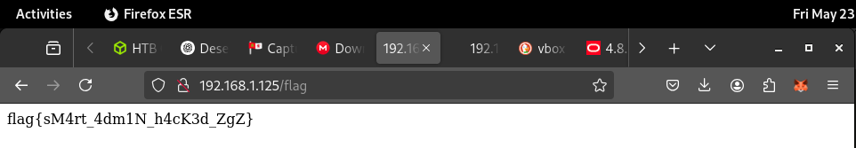

# JNIC 2025: CTF WriteUp
###### Matxin Jiménez

## Smart Admin

En este reto nos dan un .ova con una aplicación web que tenemos que vulnerar. Al lanzarla en VirtualBox vemos lo siguiente:


Si accedemos a la dirección ip entramos al portal SmartCity Zaragoza:


Desde esta página podemos reportar incidencias, pero no nos deja hacer mucho más.

Como los organzadores nos han dado el .ova en vez de hostear el servidor, podemos acceder a los archivos de VirtualBox.


Observamos que hay dos .vdi y con una busqueda encontramos que:

> A VDI file, or Virtual Disk Image, is a file format used by Oracle VM VirtualBox to store virtual hard disk images.

Montamos el disco en nuestro sistema y podemos leer y escribir todos los archivos.

Hacemos un escaneo de puertos usando nnmap y observamos que el puerto 22 esta abierto, esto es, podemos conectarnos a la maquina mediante SSH siempre y cuando tengamos credenciales validas.

```
matxin@matxin  ~  nmap 192.168.1.125
Starting Nmap 7.93 ( https://nmap.org ) at 2025-05-26 13:45 CEST
Nmap scan report for 192.168.1.125
Host is up (0.000084s latency).
Not shown: 997 closed tcp ports (conn-refused)
PORT    STATE SERVICE
22/tcp  open  ssh
80/tcp  open  http
631/tcp open  ipp
```

Aprovecho que tengo acceso al disco virtual, apago la maquina y modifico /etc/shadow y /etc/ssh/sshd_config para permitir acceso a root mediante ssh con una contraseña establecida por mi.


Nos conectamos y ...
```
matxin@matxin  ~  ssh root@192.168.1.125
root@192.168.1.125's password: 
Welcome to Ubuntu 24.04.2 LTS (GNU/Linux 6.8.0-60-generic x86_64)

 * Documentation:  https://help.ubuntu.com
 * Management:     https://landscape.canonical.com
 * Support:        https://ubuntu.com/pro

 System information as of lun 26 may 2025 11:58:33 UTC

  System load:  0.0                Processes:               107
  Usage of /:   69.9% of 10.17GB   Users logged in:         0
  Memory usage: 16%                IPv4 address for enp0s3: 192.168.1.125
  Swap usage:   0%

 * Strictly confined Kubernetes makes edge and IoT secure. Learn how MicroK8s
   just raised the bar for easy, resilient and secure K8s cluster deployment.

   https://ubuntu.com/engage/secure-kubernetes-at-the-edge

El mantenimiento de seguridad expandido para Applications está desactivado

Se pueden aplicar 5 actualizaciones de forma inmediata.
5 de estas son actualizaciones de seguridad estándares.
Para ver estas actualizaciones adicionales, ejecute: apt list --upgradable

Active ESM Apps para recibir futuras actualizaciones de seguridad adicionales.
Vea https://ubuntu.com/esm o ejecute «sudo pro status»


Last login: Fri May 23 20:16:00 2025 from 192.168.1.39
root@JNIC-SmartAdmin:~# 
```

Somos root! Pero ..., busco el flag y no encuentro nada.

Investigando veo que los archivos de la aplicación web estan en /home/jnic2025. Explorando a traves de los archivos, veo que hay un endpoint /login.

Explorando aun más los archivos de la aplicación, veo una carpeta llamada bot. Accedo a ella y leo el archivo bot.js:

```
root@JNIC-SmartAdmin:/home/jnic25/dir_21207/bot# cat bot.js
const puppeteer = require('puppeteer');

async function launchBot() {
  const browser = await puppeteer.launch({
    headless: true,
    args: ['--no-sandbox']
  });

  const page = await browser.newPage();

  try {
    console.log('[BOT] Visitando /login...');
    await page.goto('http://localhost:80/login', {
      waitUntil: 'networkidle2',
      timeout: 15000
    });

    await page.type('input[name="username"]', 'aaron');
    await page.type('input[name="password"]', 'YWFyb24mc2FyYTwz');
    await page.click('button[type="submit"]');

    await page.waitForNavigation({ waitUntil: 'networkidle2' });

    await new Promise(resolve => setTimeout(resolve, 5000));

    console.log('[BOT] Incidencia Registrada.');
  } catch (error) {
    console.error('[BOT] Error:', error.message);
  } finally {
    await browser.close();
  }
}

module.exports = { launchBot };

```

Ya tenemos credenciales. Las usamos en /login y accedemos a una página de revisión de incidencias.


Intentamos entrar a dashboard, pero no nos deja ya que la cuenta del bot no tiene privilegios de administrador.


Asi que simplemente elimino el check que hace la aplicación para comprobar si eres administrador o no y reinicio la maquina.

Antes:


Después:


Y ... estamos dentro, pero por desgracia no veo nada interesante.


Sigo investigando y veo que hay un endpoint abierto llamado /flag y entro, pero no puedo acceder. Al igual que antes, elimino el check de la aplicación y reinicio.


	
Y ... ¡Tengo el flag!



