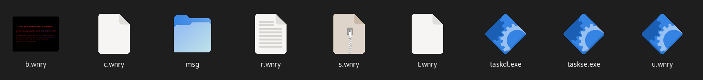

# WannaCry 2.0

md5: 84c82835a5d21bbcf75a61706d8ab549

sha1: 5ff465afaabcbf0150d1a3ab2c2e74f3a4426467

sha256: ed01ebfbc9eb5bbea545af4d01bf5f1071661840480439c6e5babe8e080e41aa

## Análisis estatico

### FLOSS
> The FLARE Obfuscated String Solver (FLOSS, formerly FireEye Labs Obfuscated String Solver) uses advanced static analysis techniques to automatically extract and deobfuscate all strings from malware binaries. You can use it just like strings.exe to enhance the basic static analysis of unknown binaries.

[FLOSS en GitHub](https://github.com/mandiant/flare-floss)


Empiezo usando la herramineta FLOSS (FLare Obfuscated String Solver). Es igual que el strings, pero busca strings que puedan estar ofuscados y además, recoje aquellos que son útiles.

He podido extraer la siguiente información:

Todas las extensiones de los archivos que encripta
```
.der .pfx .key .crt .csr .p12 .pem .odt .ott .sxw .stw .uot .3ds .max .3dm .ods .ots .sxc .stc .dif .slk .wb2 .odp .otp .sxd .std .uop .odg .otg .sxm .mml .lay .lay6 .asc .sqlite3 .sqlitedb .sql .accdb .mdb .dbf .odb .frm .myd .myi .ibd .mdf .ldf .sln .suo .cpp .pas .asm .cmd .bat .ps1 .vbs .dip .dch .sch .brd .jsp .php .asp .java .jar .class .mp3 .wav .swf .fla .wmv .mpg .vob .mpeg .asf .avi .mov .mp4 .3gp .mkv .3g2 .flv .wma .mid .m3u .m4u .djvu .svg .psd .nef .tiff .tif .cgm .raw .gif .png .bmp .jpg .jpeg .vcd .iso .backup .zip .rar .tgz .tar .bak .tbk .bz2 .PAQ .ARC .aes .gpg .vmx .vmdk .vdi .sldm .sldx .sti .sxi .602 .hwp .snt .onetoc2 .dwg .pdf .wk1 .wks .123 .rtf .csv .txt .vsdx .vsd .edb .eml .msg .ost .pst .potm .potx .ppam .ppsx .ppsm .pps .pot .pptm .pptx .ppt .xltm .xltx .xlc .xlm .xlt .xlw .xlsb .xlsm .xlsx .xls .dotx .dotm .dot .docm .docb .docx .doc
```

Referecias a DiskPart
```
DiskPart
diskpart.exe
```
> diskpart is a command-line disk partitioning utility

Strings un tanto, malignos...
```
WanaCrypt0r
```


### Detect It Easy
> Detect It Easy (DiE) is a powerful tool for file type identification, popular among malware analysts, cybersecurity experts, and reverse engineers worldwide. Supporting both signature-based and heuristic analysis, DiE enables efficient file inspections across a broad range of platforms, including Windows, Linux, and MacOS. Its adaptable, script-driven detection architecture makes it one of the most versatile tools in the field, with a comprehensive list of supported OS images.

[DiE en GitHub](https://github.com/horsicq/Detect-It-Easy)

Secciones y entropía


Podemos ver las secciones que forman el binario y su correspondiente entropía. Las secciones .rdata y .rsrc (resources) tienen una entropía alta, por lo que es probable que contengan datos encriptados u ofuscados.

Resources


Observamos que resources contiene 3 archivos y los exportamos.


El zip XIA tiene contraseña, por lo que no podemos abrirlo (de momento :) )

Los demas archivos no parecen importantes.

### IDA
> IDA Free is a disassembler and decompiler that supports x86/x86-64 processors and applications.

[Página Web de IDA](https://hex-rays.com/ida-free)

Lanzamos IDA y abrimos el sample.


Tras echar un vistazo a la función Main, algo capta mi atención.


El string "WNcry@2ol7". ¿Sera la contraseña del zip?

Efectivamente, nos permite extraer los contenidos del zip.

#### Analizando el zip



Analicemos los no ejecutables:

**b.wnry** Es una foto.


**c.wnry** contiene cadenas hexadecimales. Podemos usar una herramienta como CiberChef para hacerlo legible.

> The Cyber Swiss Army Knife - a web app for encryption, encoding, compression and data analysis.

[Página Web de CiberChef](https://cyberchef.org)

Vemos que contiene 5 links .onion.

```
gx7ekbenv2riucmf.onion; 	
57g7spgrzlojinas.onion;
xxlvbrloxvriy2c5.onion;
76jdd2ir2embyv47.onion;
cwwnhwhlz52maqm7.onion;
```

> .onion is a special-use top-level domain name designating an anonymous onion service, which was formerly known as a "hidden service", reachable via the Tor network.

Sospecho que seran las direcciones de los servidores que procesan los servicios relacionados con el ransomware (gestión de claves, verificación de pagos, atención al cliente, ...).

**msg** es una carpeta con textos explicativos sobre lo que le ha ocurrido a la victima en varios idiomas. El euskera no es uno de ellos, por lo que parece que los autores del malware no pretenden atacarnos :)

**r.wnry** es el texto que le aparece a la víctima.
```
Q:  What's wrong with my files?

A:  Ooops, your important files are encrypted. It means you will not be able to access them anymore until they are decrypted.
    If you follow our instructions, we guarantee that you can decrypt all your files quickly and safely!
    Let's start decrypting!

Q:  What do I do?

A:  First, you need to pay service fees for the decryption.
    Please send %s to this bitcoin address: %s

    Next, please find an application file named "%s". It is the decrypt software.
    Run and follow the instructions! (You may need to disable your antivirus for a while.)
    
Q:  How can I trust?

A:  Don't worry about decryption.
    We will decrypt your files surely because nobody will trust us if we cheat users.
    

*   If you need our assistance, send a message by clicking <Contact Us> on the decryptor window.
```

**s.wnry** es un zip sin contraseña con elementos relacionados con Tor, incluidos un ejecutable. Es evidente que el malware usa la red Tor para comunicarse con sus servidores.

**t.wnry** contiene el string "WANACRY!" seguido por una cadena hexadecimal inteligible.

#### Seguimos con IDA

En una de las funciones encontramos direccoines de 3 wallets de bitcoin.


Y si consultamos en el blockchain, podemos ver la cantidad de dinero que estos wallets manejan.

|     Dirección  | Dinero actual  |  Total enviado    |
|--------------------|--------------------|--------------------|
|13AM4VW2dhxYgXeQepoHkHSQuy6NgaEb94|$34,540.57|$2,070,260|
12t9YDPgwueZ9NyMgw519p7AA8isjr6SMw|$201,590|  $1,863,522
| 115p7UMMngoj1pMvkpHijcRdfJNXj6LrLn| $48,973.23| $1,511,137

Desde luego, es una actividad muy lucrativa.


Ahora voy a comentar el funcionamiento:

El ransomware empieza haciendo un identificador de la victima usando un hash del hostname, al que añade entre 8 y 15 letras y 3 números. Luego realiza varias comprobaciones, como la existencia y accesibilidad a diferentes carpetas (ProgramData, Intel, Tmp).

Lanza taskche.exe, que desconozco lo que es.

Extrae el zip usando la contraseña, selecciona una de las tres direcciones de las wallets y carga los enlaces .onion.

A continuación oculta el directorio actual, da permisos a todos los usuarios sobre el directorio (imagino que por si en un futuro solo pueden ejecutar desde otro usuario) e importa las APIs Windows Kernel32 y CryptoAPI.
		
Procesa el archivo t.wnry. Comprueba que empiece por "WANACRY!" y hace algo con el hexadecimal que lo sigue. Sospecho que sea un ejecutable encriptado. Segun he visto, usa S-Boxes para desencriptarlo.
		
Seria interesante desencriptar t.wnry, pero no cuento con el tiempo necesario para ~~hacerlo~~ intentarlo. Una opción seria ejecutar el malware en un debugger, poner un breakpoint e intentar extraerlo.

El análisis que he hecho sobre el binario es mucho mas extenso, pero sinceramente, no se como explicar aqui lo poco que he entendido. Añado el archivo sobre el que he estado trabajando para que puedas explorarlo. He añadido nombres a muchas funciones y también comentarios en varias partes del código.

[WannaCry2.0.i64](https://www.example.com)

Doy por concluido el análisis estatico.


## Análisis dinámico

Para el análisis dinámico he instalado Windows 10 en una maquina virtual y varias herramientas.


Hago un "shot" del registro usando la herramienta SnapShot

Ejecuto el malware grabando la pantalla con Process Hacker 2 abierto para poder ver que procesos lanza el malware.

Y hago otro shot del registro. Uso la propia herramienta para compararlos y obtengo:


